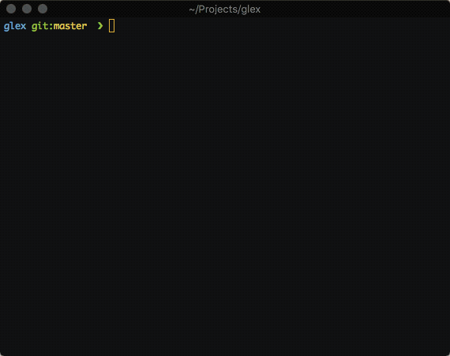

# g(it) l(og) ex(plorer) 

> Interactive `git log` explorer using [`fzf`](https://github.com/junegunn/fzf)



## Installation

CURL:

```sh
curl -o /usr/local/bin/glex https://git.io/glex && chmod 755 /usr/local/bin/glex
```

npm:

```sh
npm install -g glex
```

## Usage

```sh
$ glex [<options>]
```

Type to fuzzy-search logs.

Keys:

- **up/down**: navigate (click line also works)
- **ctrl-b**: create a branch from selected git hash
- **enter**: view full diff (less)
- **esc**: exit glex

## Related tools

[gsex](https://github.com/therealklanni/gsex) - g(it) s(tash) ex(plorer)

[gdex](https://github.com/therealklanni/gdex) - g(it) d(iff) ex(plorer)

## License

MIT © Kevin Lanni

Modified from original work by [bturrubiates](https://github.com/bturrubiates/fzf-scripts).
